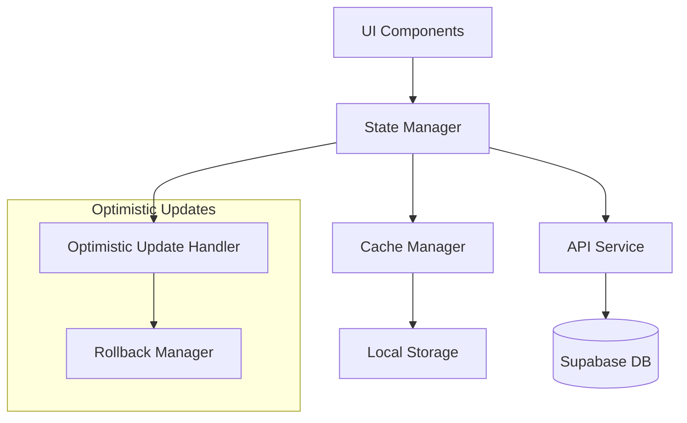
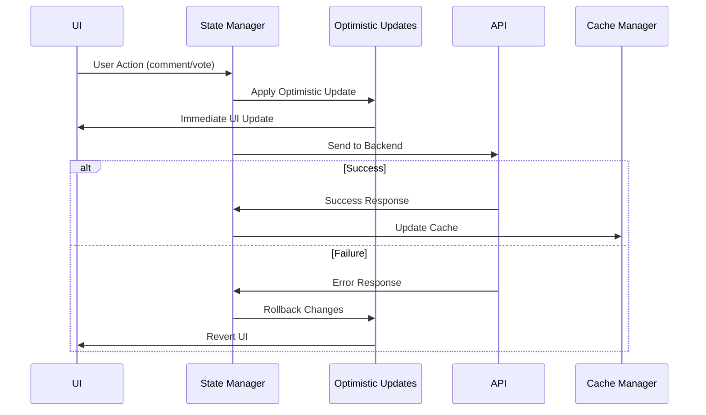

# Design Document

## Overview

This design provides real-time user experience improvements and enhanced cache management for the existing pin-based map application called "oPINion". It includes optimistic updates, centralized state management, smart cache strategies, and automatic pin cleanup features. The entire application UI will be converted to English language.

## Architecture

### High-Level Architecture



### State Management Flow



## Components and Interfaces

### 1. Enhanced State Manager

**OptimisticStateManager**

```typescript
interface OptimisticStateManager {
  // Comment operations
  addCommentOptimistic(pinId: string, text: string, userId: string): string; // returns temp ID
  confirmComment(tempId: string, realComment: Comment): void;
  rollbackComment(tempId: string): void;

  // Vote operations
  voteOptimistic(commentId: string, value: number, userId: string): void;
  confirmVote(commentId: string, newVoteData: VoteData): void;
  rollbackVote(commentId: string, previousVote: number): void;

  // Pin operations
  deletePinIfEmpty(pinId: string): Promise<boolean>;
}
```

### 2. Enhanced Cache Manager

**SmartCacheManager**

```typescript
interface SmartCacheManager extends SimpleMapCache {
  // Granular cache operations
  updatePinInCache(pinId: string, updates: Partial<Pin>): void;
  removePinFromCache(pinId: string): void;
  updateCommentCountInCache(pinId: string, delta: number): void;

  // Cache invalidation strategies
  invalidateRelatedAreas(pinId: string): void;
  scheduleRefresh(bounds: MapBounds, delay: number): void;

  // Persistence
  persistToStorage(): void;
  loadFromStorage(): void;
}
```

### 3. Comment Sorting and Display

**CommentSortManager**

```typescript
interface CommentSortManager {
  sortComments(comments: Comment[], sortBy: SortCriteria): Comment[];
  calculateNetScore(comment: Comment): number;
  getSortOptions(): SortOption[];
}

type SortCriteria = "newest" | "oldest" | "most_liked" | "net_score";

interface SortOption {
  value: SortCriteria;
  label: string;
  icon: string;
}
```

### 4. Enhanced Pin Service

**ExtendedPinService**

```typescript
interface ExtendedPinService extends PinService {
  // Auto-cleanup functionality
  checkAndDeleteEmptyPin(pinId: string): Promise<boolean>;

  // Batch operations for performance
  batchUpdateVotes(votes: VoteUpdate[]): Promise<boolean>;

  // Enhanced comment operations
  deleteCommentWithCleanup(commentId: string): Promise<{
    success: boolean;
    pinDeleted: boolean;
    error: string | null;
  }>;
}
```

## Data Models

### Enhanced Comment Model

```typescript
interface EnhancedComment extends Comment {
  // Optimistic update fields
  isOptimistic?: boolean;
  tempId?: string;

  // Calculated fields
  netScore: number;
  likeCount: number;
  dislikeCount: number;

  // UI state
  isVoting?: boolean;
  voteError?: string;
}
```

### Cache Entry Model

```typescript
interface CacheEntry {
  bounds: MapBounds;
  pins: Pin[];
  timestamp: number;
  zoom: number;

  // Enhanced fields
  lastAccessed: number;
  hitCount: number;
  priority: "high" | "medium" | "low";
}
```

### Optimistic Update State

```typescript
interface OptimisticState {
  pendingComments: Map<string, PendingComment>;
  pendingVotes: Map<string, PendingVote>;
  rollbackQueue: RollbackAction[];
}

interface PendingComment {
  tempId: string;
  pinId: string;
  text: string;
  userId: string;
  timestamp: number;
}

interface PendingVote {
  commentId: string;
  value: number;
  previousValue: number;
  userId: string;
  timestamp: number;
}
```

## Error Handling

### Error Recovery Strategies

1. **Network Errors**: Automatic retry with exponential backoff
2. **Optimistic Update Failures**: Graceful rollback with user notification
3. **Cache Corruption**: Fallback to fresh API calls
4. **Concurrent Modifications**: Conflict resolution with user choice

### Error Notification System

```typescript
interface ErrorNotificationManager {
  showError(
    message: string,
    type: "warning" | "error",
    action?: RetryAction
  ): void;
  showSuccess(message: string): void;
  clearNotifications(): void;
}

interface RetryAction {
  label: string;
  handler: () => Promise<void>;
}
```

## Implementation Details

### Optimistic Updates Implementation

```typescript
// Example optimistic comment addition
const addCommentOptimistic = (pinId: string, text: string) => {
  const tempId = `temp-${Date.now()}-${Math.random()}`;
  const optimisticComment: EnhancedComment = {
    id: tempId,
    pin_id: pinId,
    user_id: currentUserId,
    text,
    isOptimistic: true,
    tempId,
    created_at: new Date().toISOString(),
    // ... other fields
  };

  // Immediately update UI
  setComments((prev) => [...prev, optimisticComment]);

  // Send to backend
  return apiCall().then(
    (realComment) => confirmComment(tempId, realComment),
    (error) => rollbackComment(tempId)
  );
};
```

### Cache Invalidation Strategy

```typescript
const invalidationRules = {
  onCommentAdd: (pinId: string) => {
    // Invalidate caches containing this pin
    cacheManager.updatePinInCache(pinId, {
      comments_count: (prev) => prev + 1,
    });
  },

  onPinDelete: (pinId: string) => {
    // Remove from all cache entries
    cacheManager.removePinFromCache(pinId);
  },

  onVoteChange: (commentId: string) => {
    // No cache invalidation needed - handled optimistically
  },
};
```

### Auto Pin Cleanup Logic

```typescript
const deleteCommentWithCleanup = async (commentId: string) => {
  // 1. Delete comment
  const deleteResult = await pinService.deleteComment(commentId);

  if (!deleteResult.success) {
    return deleteResult;
  }

  // 2. Check if pin has remaining comments
  const comments = await pinService.getPinComments(pinId);

  if (comments && comments.length === 0) {
    // 3. Delete empty pin
    const pinDeleteResult = await pinService.deletePin(pinId);
    return {
      success: true,
      pinDeleted: pinDeleteResult.success,
      error: null,
    };
  }

  return {
    success: true,
    pinDeleted: false,
    error: null,
  };
};
```

### Comment Sorting Implementation

```typescript
const sortingStrategies = {
  newest: (comments: Comment[]) =>
    [...comments].sort(
      (a, b) =>
        new Date(b.created_at).getTime() - new Date(a.created_at).getTime()
    ),

  oldest: (comments: Comment[]) =>
    [...comments].sort(
      (a, b) =>
        new Date(a.created_at).getTime() - new Date(b.created_at).getTime()
    ),

  most_liked: (comments: Comment[]) =>
    [...comments].sort((a, b) => b.likeCount - a.likeCount),

  net_score: (comments: Comment[]) =>
    [...comments].sort((a, b) => b.netScore - a.netScore),
};
```

### UI Language Conversion

All UI text will be converted from Turkish to English:

- Button labels, placeholders, error messages
- Modal titles and descriptions
- Navigation elements and tooltips
- Form labels and validation messages
- App name displayed as "oPINion" throughout the interface

### Design System Implementation

Use **Shadcn/ui** with **Tailwind CSS** for a clean, minimal, and professional design:

**Design Principles**

- Clean and minimal interface without emojis or gradients
- Simple, understandable design focused on functionality
- Consistent spacing and typography using Tailwind utilities
- Professional color scheme with subtle contrasts
- Focus on usability for map pin placement and commenting

**Technology Stack**

- **Shadcn/ui**: Pre-built, accessible components
- **Tailwind CSS**: Utility-first CSS framework
- **Lucide React**: Simple, consistent icons
- **Radix UI**: Accessible primitives (via Shadcn/ui)

**Component Library Structure**

```typescript
// Using Shadcn/ui components
import { Button } from "@/components/ui/button";
import { Input } from "@/components/ui/input";
import { Dialog } from "@/components/ui/dialog";
import { Card } from "@/components/ui/card";
import { Badge } from "@/components/ui/badge";
import { Select } from "@/components/ui/select";
import { Toast } from "@/components/ui/toast";
import { Search } from "lucide-react";
```

**Header with Search Functionality**

- Clean header with "oPINion" branding
- Search input to find pins by name on the map
- User authentication status and profile access
- Simple navigation without clutter

**Search Implementation**

```typescript
interface SearchManager {
  searchPins(query: string, bounds: MapBounds): Promise<Pin[]>;
  highlightSearchResults(pins: Pin[]): void;
  clearSearch(): void;
}
```

**Color Scheme (Tailwind Classes)**

- Primary: `slate-900`, `slate-800`
- Secondary: `slate-600`, `slate-500`
- Background: `white`, `slate-50`
- Borders: `slate-200`, `slate-300`
- Text: `slate-900`, `slate-700`, `slate-500`
- Accent: `blue-600`, `blue-500` (for interactive elements)
- Success: `green-600`
- Warning: `yellow-600`
- Error: `red-600`

**Benefits of This Approach**

- Professional, clean appearance
- Consistent design language
- Accessible components out of the box
- Easy to maintain and extend
- Fast development with pre-built components
- Responsive design by default

## Performance Optimizations

### 1. Debounced Cache Updates

- Group multiple cache operations within 100ms
- Reduce unnecessary re-renders

### 2. Lazy Loading

- Load comments only when pin detail modal opens
- Implement virtual scrolling for large comment lists

### 3. Memory Management

- Implement LRU cache eviction
- Clear old optimistic states after timeout

### 4. Network Optimization

- Batch vote operations when possible
- Use compression for large comment payloads

## Security Considerations

### 1. Optimistic Update Validation

- Validate all optimistic updates against server response
- Implement client-side rate limiting

### 2. Cache Security

- Don't cache sensitive user data
- Implement cache encryption for local storage

### 3. Error Information Disclosure

- Sanitize error messages shown to users
- Log detailed errors server-side only
